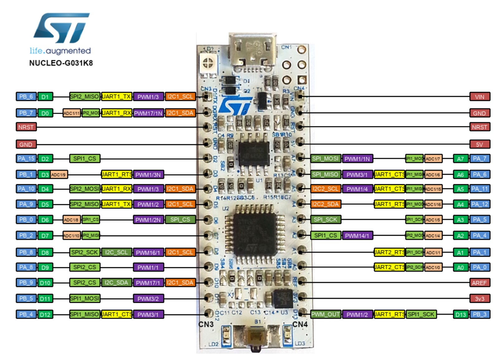

Examples for using Cortex-M0+ based stm32g0 processor. All the examples are made for Nucleo G031K8 board. The pinouts and all the alternative functionality of the board is given in the Figure below.

The board comes with ST-Link programmer / debugger so no need for an extra hardware.

DOCUMENTS

1-STM32G031K8 https://www.st.com/resource/en/datasheet/stm32g031k8.pdf

2-https://www.st.com/resource/en/reference_manual/dm00371828-stm32g0x1-advanced-armbased-32bit-mcus-stmicroelectronics.pdf -Reference Manual for STM32G0x1 Devices

3-https://www.st.com/resource/en/programming_manual/dm00104451-cortexm0-programming-manual-for-stm32l0-stm32g0-stm32wl-and-stm32wb-series-stmicroelectronics.pdf -Programming Manual for STM32G0

4-https://developer.arm.com/documentation/dui0662/b

5-https://developer.arm.com/documentation/ddi0484/c

6- Nucleo-G031K8 https://www.st.com/content/ccc/resource/technical/layouts_and_diagrams/schematic_pack/group1/05/c3/27/2a/6b/db/41/f1/MB1455-G031K8-C01_Schematic/files/MB1455-G031K8-C01_Schematic.pdf/jcr:content/translations/en.MB1455-G031K8-C01_Schematic.pdf
