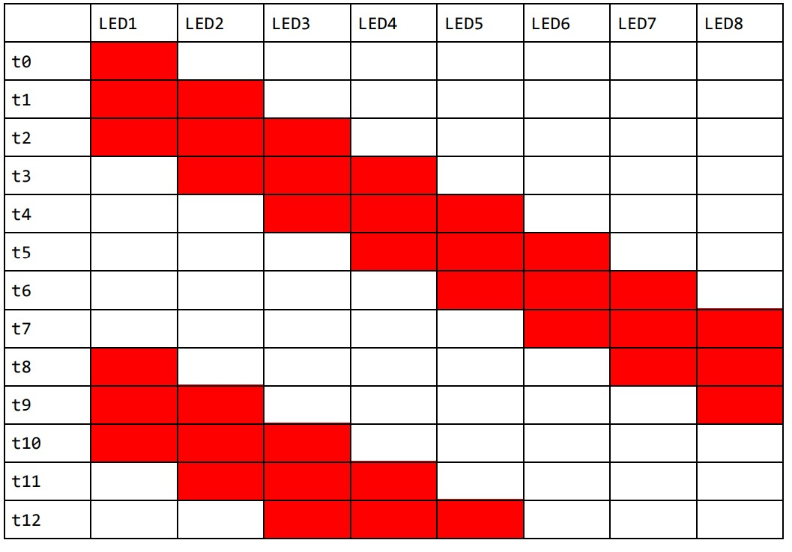

Problem1:Write assembly code that will toggle the on-board LED at a rate of 1 second.

Problem2:Connect a button to the board, and turn on the on-board LED when the button is pressed. When the button is released, the LED should turn off.

Problem3:Connect 8 external LEDs to the board, and toggle all the LEDs at the same time at a rate of 1 second.

Problem4:Connect 8 LEDs and 1 button to the board, and implement a shift pattern.

Requirements:

● The pattern should light 3 LEDs at the same time

● These 3 LEDs should shift right or left indefinitely.

● The button should toggle the shift direction when pressed. You can think of this as having
two modes (right shift and left shift). The button is used to change modes.

● There should be around 100 ms delay between transitions. (i.e. t3-t2 ~= 100 ms)

● First 12 patterns are given in Table 1 for one mode.

